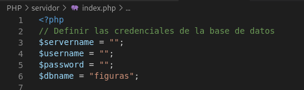

#  
 PROGRAMA QUE CALCULA EL AREA DE 3 FIGURAS 

### Autor

    Monroy Alarcon Omar Ulises

### INSTRUCCIONES

    1. Descargar el zip que otorga github para tener el código completo.
    
    2. Es necesario ejecutar el archivo que se encuentra en la  carpeta sql (para crear la base de datos y algunas tablas).

    
    3.Dentro del archivo index.php que se encuentra en la carpeta "servidor",
    debe agregar el campo  servername (con su propio servername).

    4. En el mismo archivo ingrese el usuario y la contraseña de su base de datos (para que 
    puede ser utlizada por php).

    5. Ejecute el archivo llamado  "index.html"
